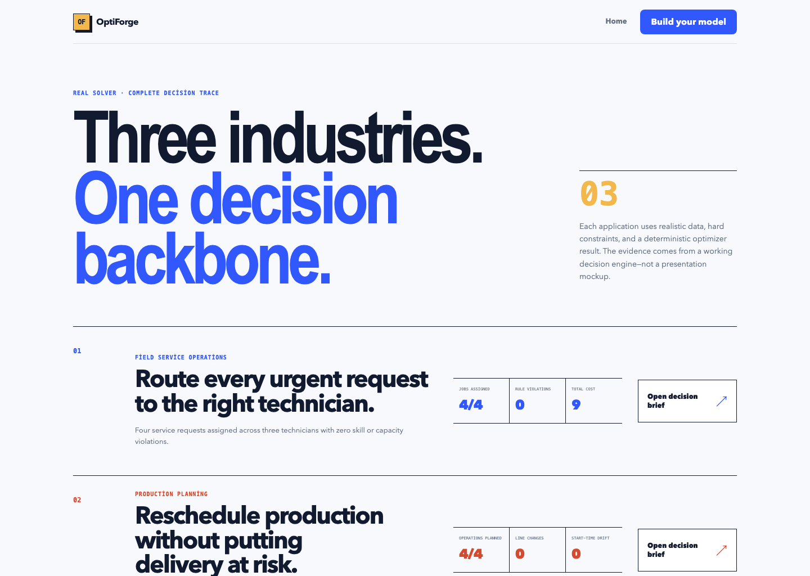
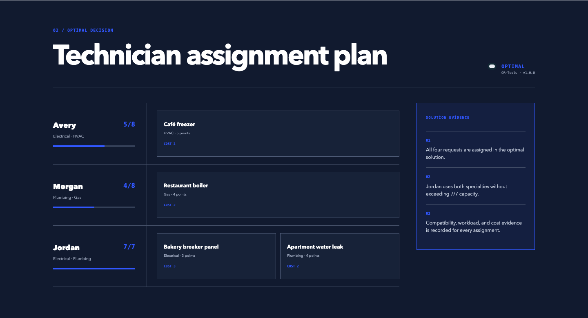
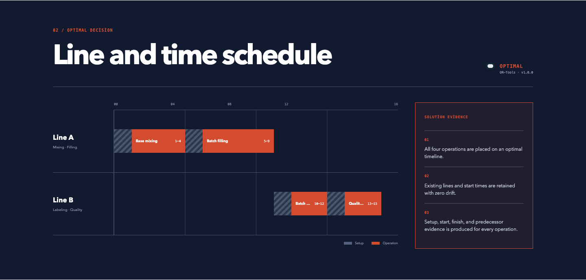
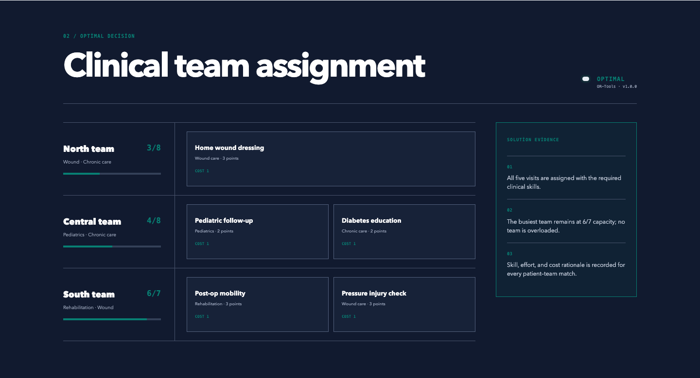

# OptiForge Showcase

[](https://github.com/yucel-yilmaz/OptiForge-Showcase/actions/workflows/ci.yml)
[](LICENSE)
[](https://nodejs.org/)

Public examples and a tiny JavaScript client for integrating with OptiForge
decision APIs. OptiForge turns business data and approved rules into versioned,
auditable optimization decisions for assignment and scheduling problems.



## What is in this repository?

- Four synthetic, reviewable optimization examples
- A zero-dependency JavaScript client with TypeScript declarations
- Synchronous and asynchronous API integration patterns
- An adoption guide for moving from a pilot decision to production
- English screenshots that explain the business outcomes

This is the public integration and showcase repository. It intentionally does
not contain the proprietary platform, optimizer service, deployment automation,
customer data, or private operating procedures.

## Real-world examples

### Field service assignment

Assign urgent jobs to qualified technicians while respecting skills, daily
capacity, visit limits, forbidden pairs, and travel or service cost.



### Production-line scheduling

Place dependent operations across production lines while preserving
availability windows, setup time, precedence, deadlines, and plan stability.



### Community healthcare assignment

Distribute home visits across clinical teams while preserving skill coverage,
regional cost, workload capacity, and maximum daily visits. All data in this
example is fictional.



### Vehicle job scheduling

Sequence dependent jobs across available vehicles and minimize changes from a
baseline plan.

## Quick start

Requirements: Node.js 20 or newer and access to an OptiForge API environment.

```bash
git clone https://github.com/yucel-yilmaz/OptiForge-Showcase.git
cd OptiForge-Showcase
npm install
npm test
```

Set environment variables in your terminal. Never commit a real API key.

```bash
export OPTIFORGE_BASE_URL="https://your-optiforge.example.com"
export OPTIFORGE_API_KEY="your-scoped-development-key"
npm run example
```

## JavaScript client

```js
import { readFile } from "node:fs/promises";
import { OptiForgeClient } from "optiforge-showcase";

const client = new OptiForgeClient({
  baseUrl: process.env.OPTIFORGE_BASE_URL,
  apiKey: process.env.OPTIFORGE_API_KEY,
});

const example = JSON.parse(
  await readFile("examples/field-service-assignment.json", "utf8")
);

const result = await client.solve("field-service-assignment", {
  data: example.data,
  solveOptions: example.solveOptions,
});

console.log(result.data.status, result.data.assignments);
```

The full model specification and its field mappings are in
[`examples/field-service-assignment.json`](examples/field-service-assignment.json).

For longer work, use the asynchronous flow:

```js
const queued = await client.enqueue("field-service-assignment", input);
const completed = await client.waitForJob(queued.data.id, {
  intervalMs: 1_000,
  timeoutMs: 60_000,
});
```

See the [HTTP API reference](docs/API.md) and
[developer adoption path](docs/ADOPTION.md) for integration guidance.

## Data and safety boundary

Every example is synthetic and contains no customer or personal data. The
client sends requests only to the `baseUrl` supplied by the caller and never
stores API keys. Keep keys in a server-side secret manager, review every hard
constraint with an operations owner, and maintain a human override for
high-impact decisions.

## Contributing and security

Small, focused contributions are welcome. Read [CONTRIBUTING.md](CONTRIBUTING.md)
and the [Code of Conduct](CODE_OF_CONDUCT.md). Report vulnerabilities through
[GitHub private vulnerability reporting](SECURITY.md), never through a public
issue.

## License

The public examples, documentation, and client in this repository are licensed
under the [Apache License 2.0](LICENSE). The license does not grant rights to
the private OptiForge platform or service implementation.
